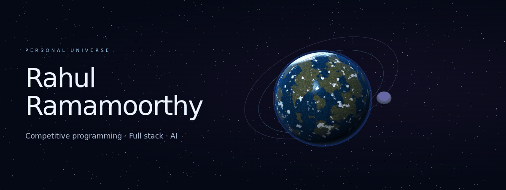
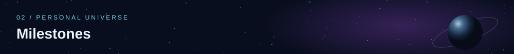
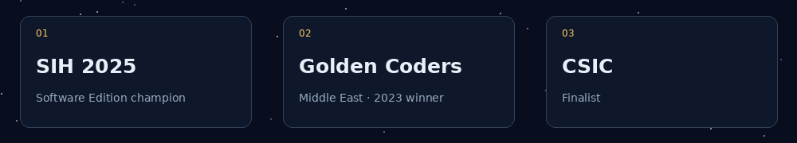
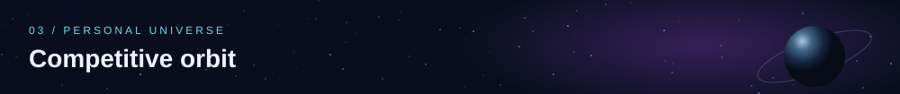
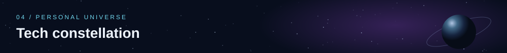
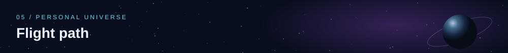
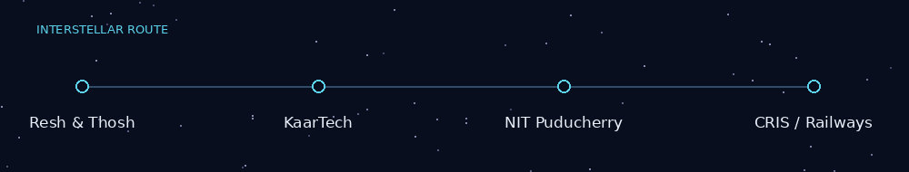
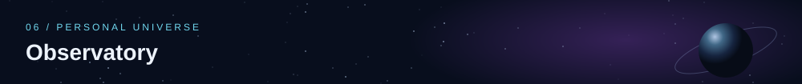
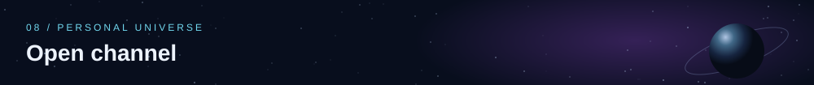
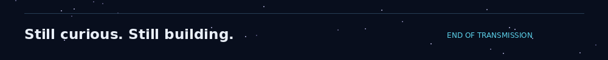

  

  <a href="https://github.com/rahul14rx?tab=repositories">Explore my work</a> ·
  <a href="https://www.linkedin.com/in/rahul-ramamoorthy-38225a284/">LinkedIn</a> ·
  <a href="mailto:rdrahul2005@gmail.com">Email me</a>

I'm Rahul, a computer science student at **Chennai Institute of Technology**, graduating in **2027**. I enjoy the jump from solving a tough algorithm problem to building something people can actually use.

My work spans full stack applications, AI experiments and systems engineering. Outside code, you'll find me painting or playing the keyboard.

I like problems that force me to rethink the first solution.

| Station | Profile |
| :--- | :--- |
| Codeforces | [RahulR\_](https://codeforces.com/profile/RahulR_) |
| CodeChef | [rdrahul2005](https://www.codechef.com/users/rdrahul2005) |
| LeetCode | [rahulrnewr](https://leetcode.com/u/rahulrnewr/) |

*The links lead to my current ratings and contest history.*

| Project | What it's about |
| :--- | :--- |
| [Nyay Sahayak](https://github.com/rahul14rx/sih_winner_loan) | Our SIH 2025 winning loan-utilization tracking app, with offline uploads and officer verification. |
| [VaultDB](https://github.com/rahul14rx/VaultDB-Distributed-SQL-Engine) | A distributed SQL engine project exploring database systems. |
| [OASIS](https://github.com/n1shanthb/OASIS) | AI workforce scheduling, developed following my CRIS internship. |
| [Raksha](https://github.com/rahul14rx/raksha-backend) | The log-ingestion backend for our CSIC project. |
| [Qumail](https://github.com/rahul14rx/qumail) | An email application project. |
| [AI Blueprint](https://github.com/rahul14rx/ai_blueprint) | BlueprintStudio, an AI-focused application project. |

[More experiments, including CryptoTracker →](https://github.com/rahul14rx?tab=repositories)

| Area | Tools I work with |
| :--- | :--- |
| Languages | Python · Java · C++ · JavaScript · TypeScript |
| Interfaces | React · Next.js · AngularJS · Tailwind CSS · Flutter |
| Backend | Node.js · Express · FastAPI · Django |
| Data & AI | PostgreSQL · MongoDB · TensorFlow · scikit-learn · OpenCV |
| Everyday tools | Git · Linux · Firebase · Jupyter |

- **CRIS / Indian Railways — Software Engineering Intern, June–July 2026.** Continued working on OASIS after the internship.
- **NIT Puducherry — Research Intern, May–July 2025.** Worked with Dr. Ansuman Mahapatra on Tamil medical question answering and reinforcement learning.
- **KaarTech — Full stack Intern, 2025.** Worked on the KEBS Help Center using AngularJS, Node.js and MySQL.
- **Resh and Thosh — Earlier internship.** Part of my first experience working in a software team.

Browse my [recent activity](https://github.com/rahul14rx) and [repositories](https://github.com/rahul14rx?tab=repositories) to see what I've been working on.

<!-- Keep your existing contribution-snake image here if its generator is already configured.
     No fabricated contribution data or unconfigured third-party cards are included. -->

Have a project, an interesting problem or a collaboration in mind? Reach me on [LinkedIn](https://www.linkedin.com/in/rahul-ramamoorthy-38225a284/) or [email](mailto:rdrahul2005@gmail.com).

